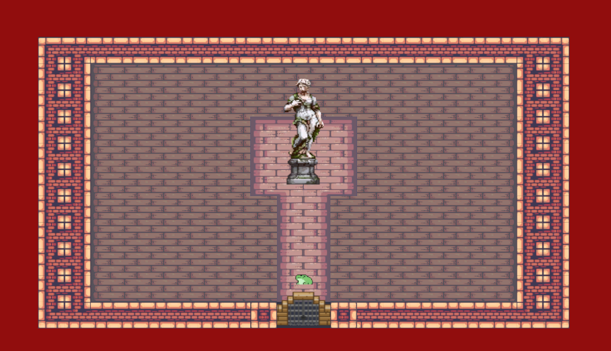

# Live Project
## Introduction

&emsp; This 2-week Live Project was an opportunity to gain experience about what an actual workplace could be like. The project itself was to create a collection of arcade games using Unity and C#. We were all allowed to pick from a list or look up an arcade game we could recreate (with the instructor’s permission, of course). For this project, I purposely picked the game I wasn’t a huge fan of, Frogger. It’s not a bad game, but I figured there would be projects I won’t always enjoy or get overly excited about. But the past two weeks were truly fun, and I now have a deeper appreciation for the game Frogger.

 
&emsp; These were the stories I was tasked with completing during my Live Project.

## User Stories
 * [Game Scenes](#game-scenes)
 * [Player Behavior](#player-behavior)
 * [Level Design](#level-design)
 * [Collectables Obstacles](#collectables-obstacles)
 * [Gameplay Model](#gameplay-model)
 * [New Level](#new-level)
 * [Animations](#animations)
 * [Enemies](#enemies)
 * [Sound Effects](#sound-effects)
 * [Polish](#polish)
 * [Skills](#skills)
##

## Game Scenes

&emsp; In this story, I had to build the scenes for the game. Main Menu, the functioning buttons, a Game Scene, and an End Scene with a replay and quit button. I didn’t want to overcomplicate it and made it a very simple, generic design for the first scene. I also wanted to ensure the scene building worked, so I added a button to the game scene to go to the main menu, gameplay, and the end scene to play again. This was around the time I wanted to go a slightly different route than the classic pixel frogger. I wanted to try applying a different theme to the game and settle on the name Dungeon Frogger.
<p align="center">   

</p>

```c#
{
    //This method will start the game
    public void playGame()
    {
        SceneManager.LoadScene(SceneManager.GetActiveScene().buildIndex + 1);
    }


    //This method will restart the game
    public void restartGame()
    {
        SceneManager.LoadScene(SceneManager.GetActiveScene().buildIndex - 1);
    }

    
    //This method will quit the game
    public void quitGame()
    {
        Debug.Log("You have quit the game");
        Application.Quit();
    }

}
```

### Misunderstanding
&emsp; Now, before I actually submitted it, I did run into a problem with the file saying it was too big to submit. I had misunderstood an aspect of the project, and I 100% own up to that. I had been under the assumption that I had to make a completely new Unity File for the game. Looking back, it makes more sense since this was a group project that I would be working on a file with multiple people who were also working on their own games. I did have to partially start over (recreate the scenes), but I copied and pasted the script from the other file I had created.


##
*Jump To: [Page Top](#introduction), [Player Behavior](#player-behavior), [Level Design](#level-design), [Collectables Obstacles](#collectables-obstacles), [Gameplay Model](#game-model), [New Level](#new-level), [Animations](#animations), [Enemies](#enemies), [Sound Effects](#sound-effects), [Polish](#polish), [Skills](#skills)*
##

## Player Behavior

&emsp; This story was simple; as the title says, it was about the player’s behavior. Now I won’t take sole credit for this movement script, I did follow this tutorial on how to actually create it (https://www.youtube.com/watch?v=GxlxZ5q__Tc by Zigurous). I added a frog sprite (made by DuckHive:https://duckhive.itch.io/froggo), a BoxCollider2D, a Rigidbody2D, and a simple script to make the player move around. I also added idle animations and a method to help flip the sprite to the left or right position.
<br/> <br/>

```c#
   private void Update()
    {
        //This if statement will check if the player has pressed the up arrow key or W key, and if so, the player sprite will move up/vertical.
        if (Input.GetKeyDown(KeyCode.W) || Input.GetKeyDown(KeyCode.UpArrow))
        {
            Move(Vector3.up);
        }
        //This else if statement will check if the player has pressed the down arrow key or S key, and if so, the player sprite will move down/vertical.
        else if (Input.GetKeyDown(KeyCode.S) || Input.GetKeyDown(KeyCode.DownArrow))
        {
            Move(Vector3.down);
        }
        //This else if statement will check if the play has pressed the left arrow key or A key, and if so, the player sprite will move left/horizontal.
        else if (Input.GetKeyDown(KeyCode.A) || Input.GetKeyDown(KeyCode.LeftArrow))
        {
            transform.rotation = Quaternion.Euler(0f, 0f, 0f); // Rotate the player sprite to face left
            Move(Vector3.left);
        }
        //This else if statement will check if the player has pressed the right arrow key or D key, and if so, the player sprite will move right/horizontal.
        else if (Input.GetKeyDown(KeyCode.D) || Input.GetKeyDown(KeyCode.RightArrow))
        {
            transform.rotation = Quaternion.Euler(0f, 180f, 0f); // Rotate the player sprite to face right
            Move(Vector3.right);
        }

    }
    //This method will move the player sprite in the direction specified by the input parameter.
    private void Move(Vector3 direction)
    {  
            transform.position += direction;
    }
```
#### Barrier Bug
&emsp; Now, technically, there were no bug movements at this stage. The player could move up, down, left, and right with no problems. But one decision I made would unfortunately bite me later on until it was I was finally able to fix it. From what I now know, it is to check the physics of the player more throughly by setting up walls and a few simple obstacles to make sure everthing works. Lessons will be learned the hard way later on…

##
*Jump To: [Page Top](#introduction), [Player Behavior](#player-behavior), [Level Design](#level-design), [Collectables Obstacles](#collectables-obstacles), [Gameplay Model](#game-model), [New Level](#new-level), [Animations](#animations), [Enemies](#enemies), [Sound Effects](#sound-effects), [Polish](#polish), [Skills](#skills)*

##

## Level Design
&emsp; For this story, I was tasked with making the actual level itself. Now, from the beginning, I decided to go with the feeling of Frogger instead of the classic design. I picked the Kings and Pigs and Pirate Bombs for the tiles. (Created by Pixel Frog:https://pixelfrog-assets.itch.io/kings-and-pigs and https://pixelfrog-assets.itch.io/pirate-bomb) To create the layout of the level. I did my best to still create ‘roads’ and ‘logs’ in a way. I also added A tile rule because I saw I would have to make another level in a future story. I did make the level too big for the camera, so I added a Cinemachine and a world confiner that follows the player.
<br/>

<p align="center">

</p>


#### Script
&emsp; I added TileCollider2D to the foreground originally when I was editing the player to keep them from leaving the level. But the player still went through them, so I just added BoxCollider2D GameObject barriers instead, and that works.

```c#
 Collider2D barrier = Physics2D.OverlapBox(destination, Vector2.one * 0.1f, 0f, LayerMask.GetMask("Barrier"));
 if (barrier != null)
 {
    return; // Barrier detected, do not move
 }
 // No barrier, move to the destination
 transform.position = destination;
```

##
*Jump To: [Page Top](#introduction), [Player Behavior](#player-behavior), [Level Design](#level-design), [Collectables Obstacles](#collectables-obstacles), [Gameplay Model](#game-model), [New Level](#new-level), [Animations](#animations), [Enemies](#enemies), [Sound Effects](#sound-effects), [Polish](#polish), [Skills](#skills)*
##

## Collectables Obstacles

&emsp; In this story, I did want to add a few things to the level. This includes moving the platforms, adding hearts, and keys. Below is the script I made for the Moving Platforms. I’m not going to take sole credit for this either. Once again, following the tutorial by Zigurous. I did add comments to remind myself what each line actually does.

```c#
    public Vector2 moveDirection = Vector2.right; // Direction of movement
    public float moveSpeed = 1f; // Speed of movement
    public int size = 1; // Size of the cycle (number of segments)

    private Vector3 leftEdge;// Left edge of the screen in world coordinates
    private Vector3 rightEdge; // Right edge of the screen in world coordinates

    private void Start()
    {
        // Calculate the left and right edges of the screen in world coordinates
        leftEdge = Camera.main.ViewportToWorldPoint(new Vector3(0f, 0, 0));
        rightEdge = Camera.main.ViewportToWorldPoint(new Vector3(1f, 0, 0));
    }

    private void Update()
    {
        // Check if the cycle is moving right and has passed the right edge
        if (moveDirection.x > 0 && (transform.position.x - size) > rightEdge.x)
        {
            // Wrap around to the left edge
            Vector3 position = transform.position;
            position.x = leftEdge.x - size;
            transform.position = position;
        }
        // Check if the cycle is moving left and has passed the left edge
        else if (moveDirection.x < 0 && (transform.position.x + size) <  leftEdge.x)
        {
            // Wrap around to the right edge
            Vector3 position = transform.position;
            position.x = rightEdge.x + size;
            transform.position = position;
        }
        // Move the cycle in the specified direction
        else
        {
            transform.Translate(moveDirection * moveSpeed * Time.deltaTime);
        }

```
<p align=center>

Platform
</p>
    

### GameSession and Hearts

&emsp; For this, I did have to add a GameSession Script to make sure there was only one game session. I added a UI to  make it easier for the player to keep track of the lives.

```c#
public void AddPlayerLives()
{
    playerLives++;
    livesText.text = playerLives.ToString();
}
```
&emsp; In the code below, it is a simple script addressing the hearts. (These keys were much simpler at the time, only containing Destroy(gameObject)). I also wanted to add a respawn as well since I was working a bit on the health system.


```c#
    private void OnTriggerEnter2D(Collider2D collision)
    {
        FindAnyObjectByType<FroggerGameSession>().AddPlayerLives(); // Add a life to the player when they collide with the heart pickup
        Destroy(gameObject); // Destroy the heart pickup when the player collides with it
    }
```


### Abyss (The water)
&emsp; Now, originally, I was content and did a few play tests to make sure the items were working, but I did realize a last-minute obstacle I forgot about. The abyss. The player could just walk through the level and not have to take the platforms. So to address this, I had the player take damage whenever they touch the “Water” area. This includes creating a grid for the abyss and attaching a PolygonCollider2D, and making sure the platforms' colliders overlap a little so the player doesn’t accidentally touch the abyss when they hop to a different platform.

```c#
//Will check if the player is touching the Abyss (aka Water layer), and if so, the player will take damage. However, if the player is on a platform, they will not take damage from the Abyss (water layer).
bool willBeOnPlatform = (platform != null);

Collider2D water = Physics2D.OverlapBox(destination, Vector2.one * 0.1f, 0f, LayerMask.GetMask("Water"));

if (water != null && !willBeOnPlatform)
{
    playerDamage();
    return;
}
```

<p align=center>
     <video src="image/FroggerAbyss.mp4" autoplay loop muted playsinline width="70%">
  Your browser does not support the video tag.
</video></p>

##
*Jump To: [Page Top](#introduction), [Player Behavior](#player-behavior), [Level Design](#level-design), [Collectables Obstacles](#collectables-obstacles), [Gameplay Model](#game-model), [New Level](#new-level), [Animations](#animations), [Enemies](#enemies), [Sound Effects](#sound-effects), [Polish](#polish), [Skills](#skills)*
##

## Gameplay Model

&emsp; In this story, I was given the task to complete the game model, which meant creating a win condition, a lose condition, the ability to quit, and the ability to replay. For this, I added a FroggerWin Script and a lose/win scene. When the player touches this BoxCollider2D, it will send the player to the winner scene.

### Winning
&emsp; When the player touches this BoxCollider2D, it will send the player to the winner scene. But this is where the keys come in. I didn’t want to make it too simple. So I added a door, added an OpenDoor Script and Frogger Inventory, and edited the keyscript.

(Apologies for the strange movement; I did take the screenshot when I was editing the movement. I was trying to make it more snappy)
<p align=center>
    

</p>


### Losing 
&emsp; For this, it was pretty simple: if this player got damaged 3 times, they would be sent to the lose scene. There, they would have the option to quit or play again. I did tweak where the play again led to. It originally led to the game scene, but now it leads to the main menu.


(I know this also looks strange since there is no animation indicating the player is reacting to the damage. But rest assured the player is getting hurt.)
<p align=center>

</p>
    

##
*Jump To: [Page Top](#introduction), [Player Behavior](#player-behavior), [Level Design](#level-design), [Collectables Obstacles](#collectables-obstacles), [Gameplay Model](#game-model), [New Level](#new-level), [Animations](#animations), [Enemies](#enemies), [Sound Effects](#sound-effects), [Polish](#polish), [Skills](#skills)*
##

## Animations

&emsp; This was simplish to complete. I had no problems with adding animation to jumping(when the player moves) and damage/death to the player. Added animation to the hearts and keys. Added animation but no movement to the enemy

&emsp; Added an animation to the door; this one was trickier. It wasn’t letting the player through. It took a little rewriting, but I was able to get the player to go through. Add the animation to trigger when the player gets the key and is close enough to the door.

<p align=center>
   
</p>

##
*Jump To: [Page Top](#introduction), [Player Behavior](#player-behavior), [Level Design](#level-design), [Collectables Obstacles](#collectables-obstacles), [Gameplay Model](#game-model), [New Level](#new-level), [Animations](#animations), [Enemies](#enemies), [Sound Effects](#sound-effects), [Polish](#polish), [Skills](#skills)*
##


## New Level

&emsp; This one should have been simple. Creating the second level was easy. I technically had all the assets I needed.

(I turn off the effect to show off the level)
<p align=center>
     <video src="image/FroggerLevelTwo.mp4" autoplay loop muted playsinline width="70%">
  Your browser does not support the video tag.
</video></p>

&emsp; But this is where I notice a bug. The player would stop at the wall, but when you kept going towards the walls, the player would do tiny little movements that I didn’t notice before. I could get the player to slowly phase through the wall and out of the game.
 
<p align=center>
    <video src="image/Bug.mp4" autoplay loop muted playsinline width="70%">
  Your browser does not support the video tag.
</video>

### Humbling Experience

&emsp; So I went hunting for a solution. I retried the Tilecollider2D. Double-checked my code, trying to see if there was something I was missing (I was). So I tried looking up the code for addressing the barriers again. But I couldn’t see anything wrong with it. After triple-checking, I dreaded the thought that there was unfortunately a chance I might have to rewrite it. I looked at others' code, even asked GPT Chat, but it honestly seemed like I would have no choice but to rewrite movement code/Barrier to hopefully fix this…

&emsp; I had prepared myself to email for assistance because I believed I had used all the resources I had…But there was something I forgot when I was doing this. I wanted to try one last thing. While the game is supposed to feel like Frogger, it doesn’t mean every code will be the same. I remember one of the tutorials I saw saying that this line of code :

 transform.Translate(movement * Time.deltaTime); // Move the player based on input 
 
Was important for the movenment for Frogger. I don’t know why, but I decided to delete it. And when I did…

<p align=center>
    <video src="image/Fix.mp4" autoplay loop muted playsinline width="70%">
  Your browser does not support the video tag.
</video>


Guess what decided to suddenly work? The barrier was stopping the player; the player could still jump onto the platforms and collect items, and still get hurt by the enemy. I was completely relieved.

Sometimes it truly is just ONE line of code.


### UI Bug

&emsp; This one was simpler to fix. I noticed that whenever I replayed, the UI would still have the old number of lives (ie., if you lost 2 lives, then you restarted, you’d start with only 1 life). So I had to update the code for the UI.

(This is only showing the code related to the UI bug specifically)
```c#
      //This class manages the game session, including player lives
    [SerializeField] int playerLives = 3;
    //Reference to the UI text component that displays the player's lives
    [SerializeField] Text livesText;
    private int currentLives;

    private void Awake()
    {
        //Check if there are multiple instances of the game session in the scene
        int numGameSessions = FindObjectsOfType<FroggerGameSession>().Length;

        if (numGameSessions > 1)
        {
            Destroy(gameObject);
        }
        else
        {
            DontDestroyOnLoad(gameObject);
        }
    }


    private void Start()
    {
        //Initialize the lives text
        livesText.text = playerLives.ToString();
    }
    //This method is called when the player dies, and it checks if the player has remaining lives
    public void ProcessPlayerDeath()
    {
        if (playerLives > 1)
        {
            TakeLife();
        }
        else
        {
            //If the player has no more lives, reset the game session and load the first scene
            ResetGameSession();
            SceneManager.LoadScene(4);
        }
    }

    //This method reduces the player's lives by one and updates the UI text
    private void TakeLife()
    {
        playerLives--;
        livesText.text = playerLives.ToString();

    }
    //This method adds a life to the player and updates the UI text
    public void AddPlayerLives()
    {
        playerLives++;
        MaxLives();
        livesText.text = playerLives.ToString();
    }


    //This method ensures that the player's lives do not exceed the maximum limit (3 in this case)
    public void MaxLives()
    {
        if (playerLives > 3)
        {
            playerLives = 3;
        }
    }

    public void ResetGameSession()
    {
        //Reset the player's lives to the initial value and load the first scene
        SceneManager.LoadScene(0);
        //this will destroy the game session object, allowing a new one to be created when the first scene is loaded
        Destroy(gameObject);
    }

    public void NextLevel()
    {
        //Load the next scene in the build index
        SceneManager.LoadScene(SceneManager.GetActiveScene().buildIndex + 1);
    }

    }


```
&emsp;  With this, it now updates properly and resets when the game restarts.


##
*Jump To: [Page Top](#introduction), [Player Behavior](#player-behavior), [Level Design](#level-design), [Collectables Obstacles](#collectables-obstacles), [Gameplay Model](#game-model), [New Level](#new-level), [Animations](#animations), [Enemies](#enemies), [Sound Effects](#sound-effects), [Polish](#polish), [Skills](#skills)*
##

## Enemies

&emsp; In this story, I was finally able to add the enemies; for this, I went with spiders and beetles in place of the cars in a normal Frogger game. I used the movement script and simply added it to the enemies. I did add the script for damaging the player earlier on (During the Game Model). So all I had to do was make sure they were set as the enemies on the sorting layer. I also added animation to the beetles.


```c#

(This is located in the Move Function)
  Collider2D enemy = Physics2D.OverlapBox(destination, Vector2.one * 0.3f, 0f, LayerMask.GetMask("Enemy"));


 private void playerDamage()
 {

     if (PlayerAudioSource != null && damageSoundSFX != null)
     {
         PlayerAudioSource.PlayOneShot(damageSoundSFX);
     }
     else
     {
         Debug.LogWarning("Missing AudioSource or damageSoundSFX!");
     }
     Debug.Log("Player hit by enemy!");
     Froggeranimator.SetTrigger("TakingDamage"); // Trigger the damage animation)
     FindAnyObjectByType<FroggerGameSession>().ProcessPlayerDeath(); // Process player death in the game session
     Invoke("Respawn", 0f); // Call the Respawn method after a delay of 0 seconds
 }
```

<p align=center>
    <video src="image/Enemy.mp4" autoplay loop muted playsinline width="70%">
  Your browser does not support the video tag.
</video>
</p>


##
*Jump To: [Page Top](#introduction), [Player Behavior](#player-behavior), [Level Design](#level-design), [Collectables Obstacles](#collectables-obstacles), [Gameplay Model](#game-model), [New Level](#new-level), [Animations](#animations), [Enemies](#enemies), [Sound Effects](#sound-effects), [Polish](#polish), [Skills](#skills)*
##

## Sound Effects

&emsp; In this story, I had to add the sound effects. Now I do feel silly about this, but I did forget about adding an Audio Source, so I was very confused about why the sounds weren’t working. But that was quickly resolved. I added a sound effect to the player’s movement when they got damage, and to the enemies (only at the beginning of the level, because the sound on loop was overwhelming).

A few lines of code where I put the sound
The player’s movement

The player's movement
```c#
if(playerStats.currentLives == 0)
{
   playerScore.UpdateScore(space_inv_HUD.GetScore());
   playerScore.UpdateWave(space_inv_HUD.GetWave());
   menu.GameOver();
}
```
The enemy's sound
```c#
if(playerStats.currentLives == 0)
{
   playerScore.UpdateScore(space_inv_HUD.GetScore());
   playerScore.UpdateWave(space_inv_HUD.GetWave());
   menu.GameOver();
}
```


##
*Jump To: [Page Top](#introduction), [Player Behavior](#player-behavior), [Level Design](#level-design), [Collectables Obstacles](#collectables-obstacles), [Gameplay Model](#game-model), [New Level](#new-level), [Animations](#animations), [Enemies](#enemies), [Sound Effects](#sound-effects), [Polish](#polish), [Skills](#skills)*
##

## Polish

&emsp; In this story, it was all about bringing everything together and adding details. Like adding songs, a sprite, a third Ending Scene, and a Fadeout Text that covers the main menu (this tells the player to collect the keys)


&emsp; I wanted to give the little frog a reason why they venture into the cave. So I added a third scene to show something waiting for the player at the end.



&emsp;  I added a FroggerFadeOutText to pop up when the game opens, just before the main menu. It briefly tells the player what to do.

```c#
public class FroggerFadeOutText : MonoBehaviour
{
    public GameObject targetCanvas; // Drag your Canvas here in the Inspector
    public float delayInSeconds = 3f;

    void Start()
    {
        if (targetCanvas == null)
        {
            targetCanvas = GameObject.Find("FindHerCanvas");
        }

        targetCanvas.SetActive(true);
        StartCoroutine(DisableAfterDelay());
    }

    IEnumerator DisableAfterDelay()
    {
        yield return new WaitForSeconds(delayInSeconds);
        // Option A: Deactivate the entire GameObject
        targetCanvas.SetActive(false);

    }
}
```

&emsp; I also wanted to add background music, but I had to look up how to add it. It was pretty simple: make a GameObject, make sure it’s attached to the GameSession (basically an object that won’t be destroyed), add an AudioSource, then assign the music.

```c#
public class SceneMusic
{
    public string sceneName;
    public AudioClip music;
}


public class BackgroundMusic : MonoBehaviour
{
    public AudioClip testClip;

    private static BackgroundMusic instance;
    private AudioSource audioSource;

    [Header("Scene Music Setup")]
    public List<SceneMusic> sceneMusicList;

    private Dictionary<string, AudioClip> musicDictionary;


    void Awake()
    {
        if (instance == null)
        {
            instance = this;
            DontDestroyOnLoad(gameObject);

            audioSource = GetComponent<AudioSource>();

            // Convert list → dictionary for fast lookup
            musicDictionary = new Dictionary<string, AudioClip>();
            foreach (var item in sceneMusicList)
            {
                if (!musicDictionary.ContainsKey(item.sceneName))
                {
                    musicDictionary.Add(item.sceneName, item.music);
                }
            }
        }
        else
        {
            Destroy(gameObject);
        }
    }

    void OnEnable()
    {
        SceneManager.sceneLoaded += OnSceneLoaded;
    }

    void OnDisable()
    {
        SceneManager.sceneLoaded -= OnSceneLoaded;
    }

    void OnSceneLoaded(Scene scene, LoadSceneMode mode)
    {
        if (musicDictionary.TryGetValue(scene.name, out AudioClip newClip))
        {
            if (audioSource.clip != newClip)
            {
                audioSource.clip = newClip;
                audioSource.Play();
            }
            else if (!audioSource.isPlaying)
            {
                audioSource.Play();
            }
        }
        else
        {
            // No entry = no music (menu, etc.)
            audioSource.Stop();
        }

    }
}
```

&emsp; In retrospect, I would have worded the text on the FroggerFadeOutText better. I realized when replaying a few days later that it might imply that there are 6 keys in each level, but there are only 3 keys in each level.


## Skills


  #### Hindsight
&emsp; Now, looking back at the entirety of the project does make me wish I had done a lot of things differently. (Making better methods to better clean up the code and testing more thoroughly) It feels more like a frankenstein of code that somehow works, but I think overall it was a good experience to still go through. I know I still have a lot to learn, but now I know my shortcomings a bit better and will do better to address them. I’ll definitely like to revisit this project one day and remake it when I have more experience. And I don’t plan to stop making these arcade games either. I still have the list and plan to keep practicing. Because practice makes Improvement.

##
*Jump To: [Page Top](#introduction), [Player Behavior](#player-behavior), [Level Design](#level-design), [Collectables Obstacles](#collectables-obstacles), [Gameplay Model](#game-model), [New Level](#new-level), [Animations](#animations), [Enemies](#enemies), [Sound Effects](#sound-effects), [Polish](#polish), [Skills](#skills)*
##
